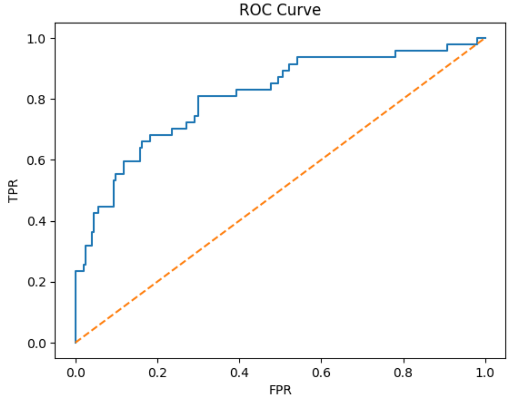
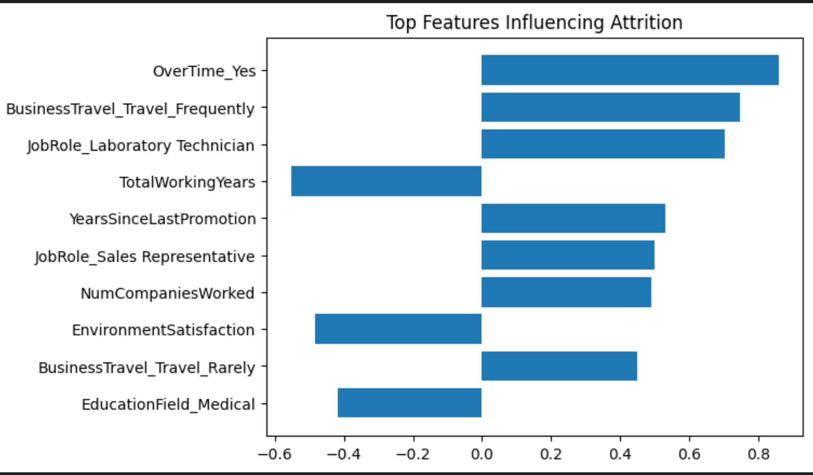

#  Employee Attrition Prediction using Machine Learning

Predict whether an employee is likely to leave the company using HR analytics data and supervised machine learning.

This project builds a complete end-to-end ML pipeline including preprocessing, modeling, evaluation, and business insights.

---

## Problem Statement

Employee attrition leads to:

- Hiring costs
- Training expenses
- Productivity loss

Goal:
> Predict employee attrition early so HR teams can take preventive action.

This is treated as a **binary classification problem**:
- 0 → Stay
- 1 → Leave

---

##  Dataset

**IBM HR Analytics Employee Attrition Dataset**

- 1470 employees
- 35 original features
- Demographics, salary, satisfaction, job role, overtime, etc.

After encoding → **45 numeric features**

Target imbalance:
- Stay ≈ 84%
- Leave ≈ 16%

---

## Tech Stack

- Python
- Pandas, NumPy
- Scikit-learn
- Matplotlib, Seaborn
- Jupyter / Colab

---

##  ML Pipeline

### 1 Data Preprocessing
- Removed ID & constant columns
- One-Hot Encoding for categorical variables
- Feature Scaling using StandardScaler

### 2️ Train-Test Split
- 80% train / 20% test
- Stratified sampling (handles imbalance)

### 3️ Models Trained
- Logistic Regression (baseline)
- Random Forest
- Balanced Random Forest

### 4️ Evaluation Metrics
- Precision
- Recall
- F1-score
- Confusion Matrix
- ROC-AUC

---

##  Results

### 🔹 Logistic Regression (Best Model)

Confusion Matrix:

| | Pred 0 | Pred 1 |
|---------|---------|---------|
Actual 0 | 237 | 10 |
Actual 1 | 31 | 16 |

Metrics:

- Accuracy: **86%**
- Recall (Attrition): **34%**
- Precision: **61%**
- ROC-AUC: **~0.85**

 Best at detecting employees likely to leave

---

###  Random Forest

- High accuracy but very low recall
- Predicted majority class only
- Not suitable for imbalanced dataset

---

###  Balanced Random Forest

- Slight improvement
- Still underperformed Logistic Regression

---

##  ROC Curve

Shows strong class separation ability.

(Add your ROC screenshot here)

---

##  Feature Importance (Business Insights)

Top factors influencing attrition:

- Overtime (Yes)
- Frequent business travel
- Laboratory Technician role
- Low total working years
- Years since last promotion
- Low environment satisfaction
- High number of previous companies

 Interpretation:
Employees with overtime, low satisfaction, or stagnant career growth are more likely to leave.

---

##  Key Learnings

- Handling categorical data using One-Hot Encoding
- Working with imbalanced datasets
- Why accuracy is misleading
- Importance of Recall for business problems
- Model comparison and selection
- Interpreting ML results for decision making

---

